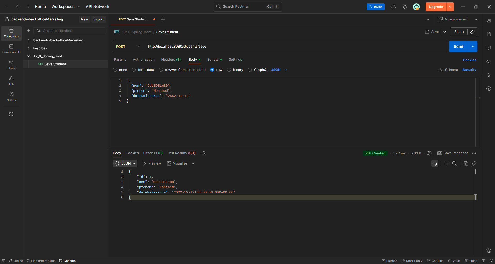
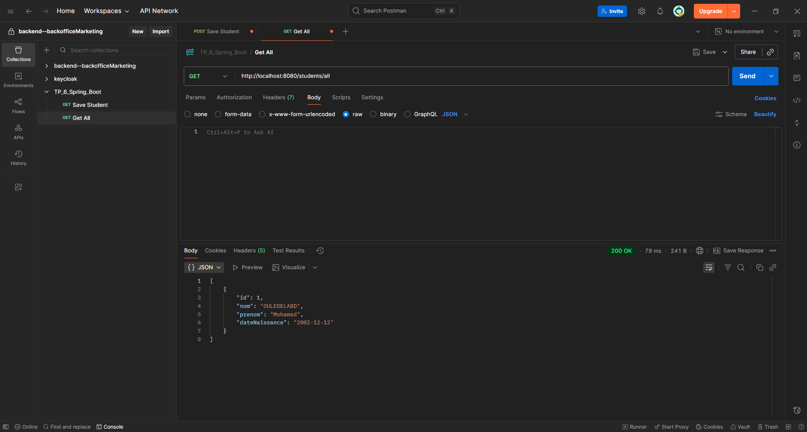
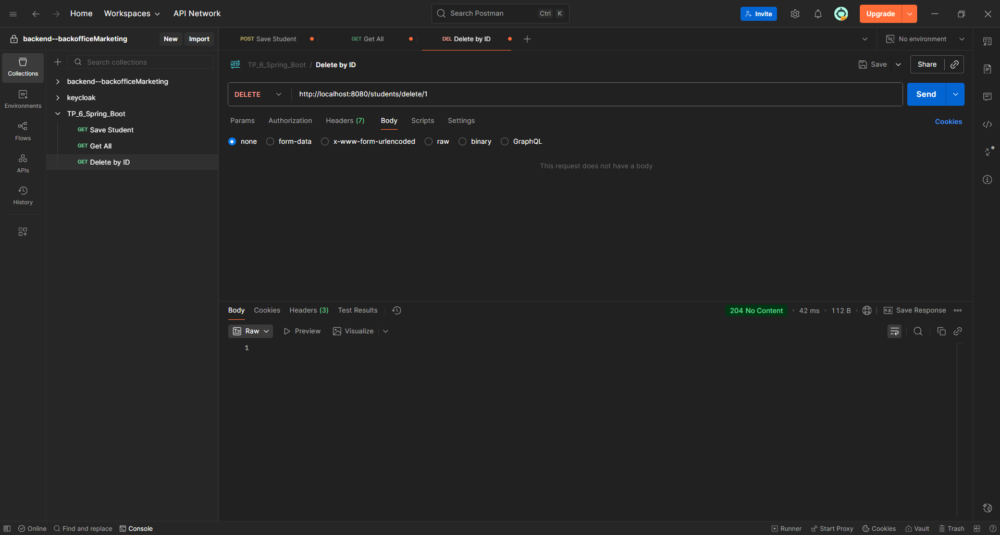
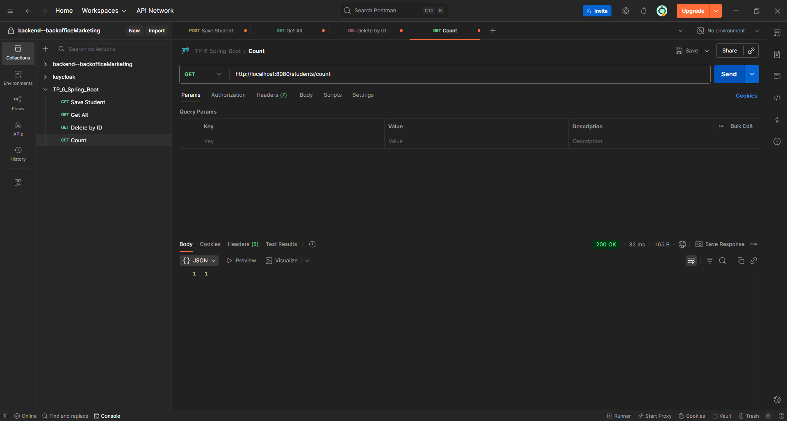
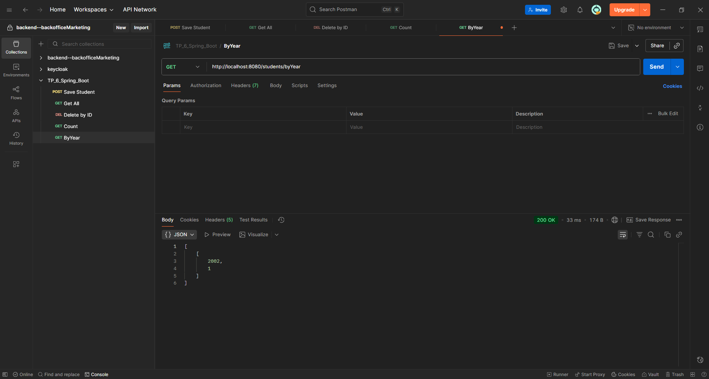
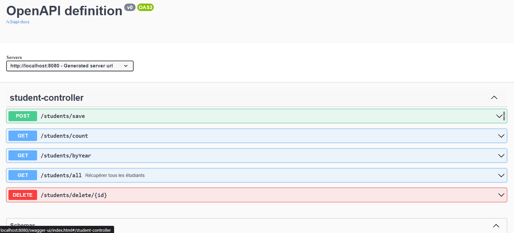

Test de l’ajout d’un étudiant (POST)

Test de la récupération de tous les étudiants (GET)

Test de la suppression d’un étudiant (DELETE)

Test du comptage des étudiants (GET)

Test du nombre d’étudiants par année de naissance (GET)

Interface Swagger

Les tests unitaires

