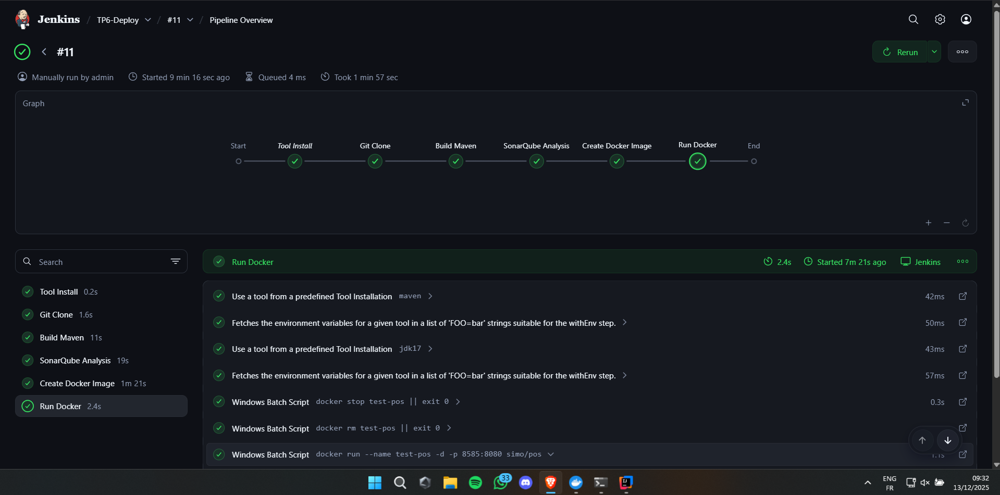
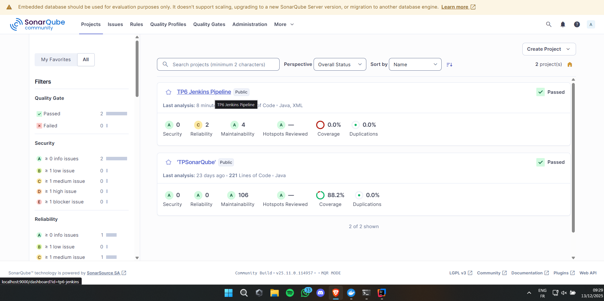

Test de l’ajout d’un étudiant (POST) : 

Test de la récupération de tous les étudiants (GET)

Test de la suppression d’un étudiant (DELETE)

Test du comptage des étudiants (GET)

Test du nombre d’étudiants par année de naissance (GET)

Interface Swagger

Les tests unitaires

# **partie CI/CD:**
Pipeline : 

Projet SonarQube :

Code pour pipeline :
pipeline {
agent any

    // Cette partie va télécharger et installer Maven tout seul la première fois
    tools {
        maven 'maven'
        jdk 'jdk17' 
    }

    stages {
        stage('Git Clone') {
            steps {
                script {
                    // J'ai mis VOTRE url GitHub ici au lieu de celle du TP
                    checkout([$class: 'GitSCM',
                        branches: [[name: 'main']],
                        userRemoteConfigs: [[url: 'https://github.com/simoelabd/TP6-SpringBoot-Swagger']]
                    ])
                }
            }
        }

        stage('Build Maven') {
            steps {
                // Compilation du projet et création du .jar
                bat 'mvn clean install -DskipTests'
            }
        }
        
        // --- NOUVEAU STAGE SONARQUBE ---
        stage('SonarQube Analysis') {
            steps {
                script {
                    // On appelle le serveur configuré à l'étape 1 ('sonar-server')
                    withSonarQubeEnv('sonar-server') {
                        // On lance l'analyse via Maven
                        // J'ai mis un nom de projet clair pour le dashboard
                        bat 'mvn sonar:sonar -Dsonar.projectKey=tp6-jenkins -Dsonar.projectName="TP6 Jenkins Pipeline"'
                    }
                }
            }
        }

        stage('Create Docker Image') {
            steps {
                // Création de l'image Docker
                bat 'docker build -t simo/pos .'
            }
        }

        stage('Run Docker') {
            steps {
                script {
                    // 1. Nettoyage : On supprime l'ancien conteneur s'il existe (pour éviter l'erreur "Name already used")
                    bat 'docker stop test-pos || exit 0'
                    bat 'docker rm test-pos || exit 0'
                    
                    // 2. Lancement :
                    // -p 8585:8080 -> On mappe le port 8585 de Windows vers le 8080 du conteneur
                    bat "docker run --name test-pos -d -p 8585:8080 simo/pos"
                }
            }
        }
    }
}
